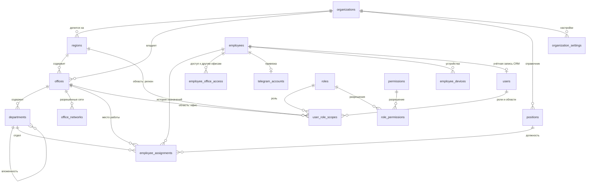
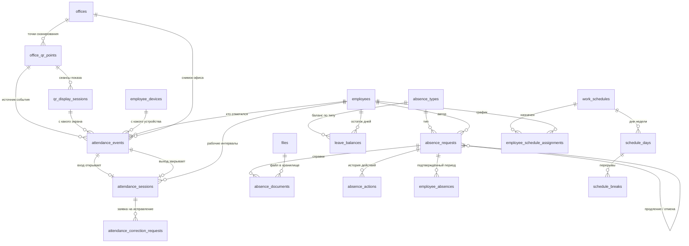

# Схема базы данных HUMOTECH HR

PostgreSQL 15+ с расширениями `btree_gist` и `pgvector`, SQLAlchemy 2.0,
миграции Alembic. 44 таблицы.

Модели: `apps/backend-api/src/modules/*/models.py`
Миграции: `apps/backend-api/migrations/versions/0001_initial_schema.py`,
`0002_ai_assistant.py`

Устройство AI-ассистента, работающего поверх таблиц базы знаний, описано
отдельно: [`docs/architecture/ai-assistant.md`](../architecture/ai-assistant.md)

---

## 1. Принципы, на которых построена схема

**Один сервис у базы.** К PostgreSQL подключается только `backend-api`. CRM,
Telegram-бот и QR-дисплей ходят исключительно через его HTTP API. Это не
пожелание к архитектуре, а условие, при котором права доступа вообще имеют
смысл: если клиент может открыть соединение с базой, любая проверка прав
в приложении обходится.

**Ключи — UUID, генерирует база.** `id UUID PRIMARY KEY DEFAULT gen_random_uuid()`.
Функция входит в ядро PostgreSQL с версии 13, расширение `pgcrypto` не нужно.

**Время — только `TIMESTAMPTZ`, хранится в UTC.** Локальное время появляется
на границе системы, при показе пользователю. Часовой пояс офиса лежит
в `offices.timezone` отдельно от организации: «опоздал на 15 минут» считается
в поясе офиса, а не сервера.

**Ничего не удаляем физически.** Сотрудники, офисы, заявки и события уходят
в архив (`archived_at`) или меняют статус. На уровне базы это подкреплено
`ON DELETE RESTRICT` — попытка удалить сотрудника с историей отметок падает
с ошибкой внешнего ключа, а не тихо стирает данные.

**`organization_id` почти везде.** Даже пока организация одна. Добавить колонку
в живую таблицу на миллионы строк потом — это простой; заложить сразу — бесплатно.

**Статусы — `VARCHAR` + `CHECK`, а не native `ENUM`.** Добавить значение в CHECK
это короткая миграция; расширение native enum блокирует таблицу и плохо
откатывается. Списки значений собраны в
`apps/backend-api/src/core/database/enums.py` — оттуда их берут и код, и seed,
и эта документация.

**Face Recognition отсутствует.** Биометрии, шаблонов лиц, liveness и
Face-терминалов в схеме нет. Вход и выход фиксируются только через QR-точки
офиса.

---

## 2. ER-диаграмма: организация и сотрудники



## 3. ER-диаграмма: QR, отметки, отсутствия



---

## 4. `attendance_events` и `attendance_sessions` — в чём разница

Это самая частая ошибка при чтении схемы, поэтому отдельно.

| | `attendance_events` | `attendance_sessions` |
|---|---|---|
| Что это | **журнал** попыток отметки | **вывод**: интервал «пришёл — ушёл» |
| Кто пишет | обработчик скана | тот же обработчик, но как следствие |
| Одна строка = | одно сканирование QR | один рабочий интервал |
| Изменяется | **никогда** | да: закрывается, пересчитывается, корректируется |
| `updated_at` | нет — строка неизменяема | есть |
| Отклонённые попытки | **да, обязательно** | нет, никогда |

Логика связи:

1. Сканирование → строка в `attendance_events` **всегда**, даже если попытка
   отклонена. Отклонённые попытки — самый ценный материал для расследования:
   именно по ним видно, что кто-то пробует чужой QR, просроченный токен или
   отметку из дома.
2. `verification_status = REJECTED` → сессия **не создаётся и не закрывается**.
   Это проверяется тестом `test_rejected_scan_never_creates_session`.
3. `ACCEPTED` + `ENTRY` → открывается новая `attendance_sessions` со статусом
   `OPEN`.
4. `ACCEPTED` + `EXIT` → последняя открытая сессия закрывается: проставляются
   `exit_event_id`, `ended_at`, `duration_seconds`, статус `CLOSED`.
5. Ошиблись — заводится `attendance_correction_requests`. Событие при этом
   **не редактируется**: сессия получает статус `CORRECTED`, а журнал остаётся
   свидетельством того, что произошло на самом деле.

Гарантия «не более одной открытой сессии» держится не кодом, а базой:

```sql
CREATE UNIQUE INDEX uq_attendance_sessions_one_open
    ON attendance_sessions (employee_id) WHERE status = 'OPEN';
```

`duration_seconds` считает бэкенд и хранит как факт — чтобы отчёты не зависели
от того, как считать, и не менялись задним числом при правке правил.

---

## 5. Правила QR

**QR принадлежит точке офиса, а не сотруднику.** Сотрудник определяется по
привязанному Telegram-аккаунту (`telegram_accounts`), офис — по
`office_qr_points.office_id`. `office_id`, присланный клиентом, не используется
никогда и ни при каких условиях.

**Сырой токен в базе не хранится:**

| Режим | Что в базе | Безопасность |
|---|---|---|
| `ROTATING` (по умолчанию) | ничего: только `rotation_seconds` и `token_version` | токен подписан сервером и живёт 45 секунд |
| `STATIC` | только `static_token_hash` | **режим MVP, заметно слабее** |

Подписанный rotating-токен несёт: `qr_point_id`, `display_session_id`,
`direction`, `issued_at`, `expires_at`, `nonce`, `signature`. Открытого
`office_id` без подписи в QR нет.

Отдельной строки в базе на каждый выпущенный QR **не создаётся** — при 45
секундах это были бы миллионы строк в сутки. Строка появляется одна на весь
сеанс показа (`qr_display_sessions`), а одноразовость обеспечивает
`attendance_events.qr_nonce_hash`.

**Что сервер проверяет при каждом скане** (порядок — как в
`qr_attendance/service.py`):

1. точка активна и не в архиве → иначе `QR_POINT_INACTIVE`;
2. токен не просрочен → иначе `QR_EXPIRED`;
3. время клиента не расходится с серверным больше чем на 5 минут → `CLOCK_DRIFT`;
4. nonce ещё не был принят у этого сотрудника → `NONCE_REUSED`;
5. сотрудник имеет право быть в этом офисе (основное назначение или
   `employee_office_access`) → `OFFICE_NOT_ALLOWED`;
6. геолокация, если она обязательна для точки → `GEOLOCATION_REQUIRED`;
7. IP из офисной сети, если проверка включена → `NETWORK_REQUIRED`;
8. вход при уже открытой сессии → `ALREADY_INSIDE`; выход без открытой сессии →
   `NOT_INSIDE`.

`verification_status` ставит **только сервер**. Клиент не может прислать
готовый результат проверки — он присылает лишь наблюдения (координаты, IP,
время), а решение принимается на бэкенде.

**Отступление от ТЗ, требующее внимания.** В задании было
`UNIQUE(employee_id, qr_nonce_hash, event_type)` без условий. Такой индекс
делает невозможным одновременное выполнение двух других требований: «запрещай
повторное использование nonce» и «все отклонённые попытки тоже сохраняй
в `attendance_events`». При сплошном UNIQUE вторая попытка с тем же nonce
не смогла бы записаться даже как `REJECTED` — то есть попытка обмана исчезла бы
из журнала. Поэтому индекс сделан частичным:

```sql
CREATE UNIQUE INDEX uq_attendance_events_nonce
    ON attendance_events (employee_id, qr_nonce_hash, event_type)
 WHERE qr_nonce_hash IS NOT NULL AND verification_status = 'ACCEPTED';
```

Nonce остаётся строго одноразовым, а все попытки его повторить видны в журнале.

**Статический QR не даёт гарантий.** Его можно сфотографировать и переслать.
Ограничения `require_geolocation`, `require_office_network` и привязка
устройства (`employee_devices`) снижают риск, но не устраняют его. Для
production предусмотрен `ROTATING`; `STATIC` оставлен как режим запуска
и помечен в схеме как менее безопасный.

---

## 6. Правила внешних ключей

| Правило | Где | Зачем |
|---|---|---|
| `RESTRICT` | organizations, regions, offices, employees, attendance_events, attendance_sessions, absence_requests, employee_absences | исторические данные не должны исчезать; удаление сотрудника с историей падает с ошибкой |
| `CASCADE` | role_permissions, schedule_days, schedule_breaks | чисто технические зависимые строки, отдельного смысла не имеют |
| `SET NULL` | reviewed_by_user_id, assigned_to_user_id, actor_user_id, granted_by_user_id, approved_by_user_id, verified_by_user_id, started_by_user_id, assigned_by_user_id, uploaded_by_user_id | администратора могут удалить или заблокировать — заявка, аудит и выданный доступ обязаны остаться |

`audit_logs.entity_id` — полиморфная ссылка, внешнего ключа у неё нет
и быть не может: она указывает на любую таблицу системы. Целостность здесь
обеспечивает пара `(entity_type, entity_id)`.

---

## 7. Ограничения, вынесенные в базу

Всё это проверяет PostgreSQL, а не прикладной код — значит, обойти нельзя даже
ошибкой в сервисе:

| Правило | Механизм |
|---|---|
| не более одной открытой сессии у сотрудника | частичный UNIQUE INDEX по `status = 'OPEN'` |
| один nonce — одно принятое использование | частичный UNIQUE INDEX по `verification_status = 'ACCEPTED'` |
| нет пересекающихся основных назначений | `EXCLUDE USING gist (employee_id =, daterange &&) WHERE is_primary` |
| нет пересекающихся графиков сотрудника | `EXCLUDE USING gist (employee_id =, daterange &&)` |
| `end_at >= start_at` во всех периодах | `CHECK` на каждой таблице с интервалом |
| `termination_date >= hire_date` | `CHECK` на `employees` |
| область роли — либо регион, либо офис | `CHECK (region_id IS NULL OR office_id IS NULL)` |
| отметка по QR обязана иметь QR-точку | `CHECK (source <> 'QR' OR qr_point_id IS NOT NULL)` |
| у STATIC-точки есть hash, у ROTATING — время жизни | `CHECK` на `office_qr_points` |
| email уникален в организации без учёта регистра | UNIQUE INDEX по `(organization_id, lower(email))` |
| один сотрудник — одна учётка CRM | частичный UNIQUE INDEX `WHERE employee_id IS NOT NULL` |

Два `EXCLUDE`-ограничения требуют расширения `btree_gist`; оно создаётся первой
строкой миграции.

---

## 8. Seed-данные

`apps/backend-api/scripts/seed.py`, скрипт идемпотентен.

- **7 системных ролей** (`organization_id IS NULL`): `SUPER_ADMIN`, `HR_ADMIN`,
  `REGIONAL_HR`, `OFFICE_ADMIN`, `MANAGER`, `ACCOUNTANT`, `TECH_ADMIN`.
- **35 разрешений** из `src/core/permissions/catalog.py` и их привязка к ролям.
- **6 типов отсутствий** для конкретной организации: `SICK_LEAVE`,
  `ANNUAL_LEAVE`, `UNPAID_LEAVE`, `BUSINESS_TRIP`, `REMOTE_WORK`, `TRAINING`.

Роль отвечает на вопрос «что можно делать», область в `user_role_scopes` —
на вопрос «с чьими данными». Поэтому у `REGIONAL_HR` и `HR_ADMIN` наборы прав
похожи: разница не в списке разрешений, а в области видимости.

---

## 9. Справочник таблиц

Ниже — полный список колонок и ограничений, сгенерированный из моделей.

### Организация и структура

#### `organizations`

| Колонка | Тип | NULL | Примечание |
|---|---|---|---|
| `code` | VARCHAR(50) | нет | — |
| `name` | VARCHAR(255) | нет | — |
| `default_timezone` | VARCHAR(100) | нет | — |
| `status` | VARCHAR(30) | нет | — |
| `knowledge_revision` | INTEGER | нет | default `1` |
| `id` | UUID | нет | PK, default `gen_random_uuid()` |
| `updated_at` | DATETIME | нет | default `now()` |
| `created_at` | DATETIME | нет | default `now()` |
| `archived_at` | DATETIME | да | — |

- CHECK `ck_organizations_status`: `status IN ('ACTIVE', 'INACTIVE', 'ARCHIVED')`
- UNIQUE INDEX `uq_organizations_lower_code`: (lower(code))

#### `organization_settings`

| Колонка | Тип | NULL | Примечание |
|---|---|---|---|
| `key` | VARCHAR(100) | нет | — |
| `value` | JSONB | нет | — |
| `id` | UUID | нет | PK, default `gen_random_uuid()` |
| `organization_id` | UUID | нет | FK → `organizations.id` `RESTRICT` |
| `updated_at` | DATETIME | нет | default `now()` |
| `created_at` | DATETIME | нет | default `now()` |

- INDEX `ix_organization_settings_organization_id`: (organization_id)
- UNIQUE INDEX `uq_organization_settings_org_key`: (organization_id, key)

#### `regions`

| Колонка | Тип | NULL | Примечание |
|---|---|---|---|
| `code` | VARCHAR(50) | нет | — |
| `name` | VARCHAR(255) | нет | — |
| `timezone` | VARCHAR(100) | да | — |
| `status` | VARCHAR(30) | нет | — |
| `id` | UUID | нет | PK, default `gen_random_uuid()` |
| `organization_id` | UUID | нет | FK → `organizations.id` `RESTRICT` |
| `updated_at` | DATETIME | нет | default `now()` |
| `created_at` | DATETIME | нет | default `now()` |
| `archived_at` | DATETIME | да | — |

- UNIQUE `uq_regions_org_code`: (organization_id, code)
- CHECK `ck_regions_status`: `status IN ('ACTIVE', 'INACTIVE', 'ARCHIVED')`
- INDEX `ix_regions_organization_id`: (organization_id)

#### `offices`

| Колонка | Тип | NULL | Примечание |
|---|---|---|---|
| `region_id` | UUID | нет | FK → `regions.id` `RESTRICT` |
| `code` | VARCHAR(50) | нет | — |
| `name` | VARCHAR(255) | нет | — |
| `address` | TEXT | нет | — |
| `timezone` | VARCHAR(100) | нет | — |
| `latitude` | NUMERIC(9, 6) | да | — |
| `longitude` | NUMERIC(9, 6) | да | — |
| `geofence_radius_m` | INTEGER | да | — |
| `status` | VARCHAR(30) | нет | — |
| `opened_at` | DATE | да | — |
| `closed_at` | DATE | да | — |
| `id` | UUID | нет | PK, default `gen_random_uuid()` |
| `organization_id` | UUID | нет | FK → `organizations.id` `RESTRICT` |
| `updated_at` | DATETIME | нет | default `now()` |
| `created_at` | DATETIME | нет | default `now()` |
| `archived_at` | DATETIME | да | — |

- CHECK `ck_offices_geofence_positive`: `geofence_radius_m IS NULL OR geofence_radius_m > 0`
- CHECK `ck_offices_close_after_open`: `closed_at IS NULL OR opened_at IS NULL OR closed_at >= opened_at`
- CHECK `ck_offices_status`: `status IN ('ACTIVE', 'INACTIVE', 'CLOSED', 'ARCHIVED')`
- UNIQUE `uq_offices_org_code`: (organization_id, code)
- INDEX `ix_offices_organization_id`: (organization_id)
- INDEX `ix_offices_region_id`: (region_id)

#### `office_networks`

| Колонка | Тип | NULL | Примечание |
|---|---|---|---|
| `office_id` | UUID | нет | FK → `offices.id` `RESTRICT` |
| `name` | VARCHAR(100) | нет | — |
| `network_cidr` | CIDR | нет | — |
| `is_active` | BOOLEAN | нет | default `true` |
| `id` | UUID | нет | PK, default `gen_random_uuid()` |
| `organization_id` | UUID | нет | FK → `organizations.id` `RESTRICT` |
| `updated_at` | DATETIME | нет | default `now()` |
| `created_at` | DATETIME | нет | default `now()` |

- UNIQUE `uq_office_networks_cidr`: (office_id, network_cidr)
- INDEX `ix_office_networks_office_id`: (office_id)
- INDEX `ix_office_networks_organization_id`: (organization_id)

#### `departments`

| Колонка | Тип | NULL | Примечание |
|---|---|---|---|
| `office_id` | UUID | нет | FK → `offices.id` `RESTRICT` |
| `parent_department_id` | UUID | да | FK → `departments.id` `RESTRICT` |
| `code` | VARCHAR(50) | нет | — |
| `name` | VARCHAR(255) | нет | — |
| `status` | VARCHAR(30) | нет | — |
| `id` | UUID | нет | PK, default `gen_random_uuid()` |
| `organization_id` | UUID | нет | FK → `organizations.id` `RESTRICT` |
| `updated_at` | DATETIME | нет | default `now()` |
| `created_at` | DATETIME | нет | default `now()` |
| `archived_at` | DATETIME | да | — |

- CHECK `ck_departments_no_self_parent`: `parent_department_id IS NULL OR parent_department_id <> id`
- CHECK `ck_departments_status`: `status IN ('ACTIVE', 'INACTIVE', 'ARCHIVED')`
- UNIQUE `uq_departments_office_code`: (office_id, code)
- INDEX `ix_departments_office_id`: (office_id)
- INDEX `ix_departments_organization_id`: (organization_id)
- INDEX `ix_departments_parent_department_id`: (parent_department_id)

#### `positions`

| Колонка | Тип | NULL | Примечание |
|---|---|---|---|
| `code` | VARCHAR(50) | нет | — |
| `name` | VARCHAR(255) | нет | — |
| `description` | TEXT | да | — |
| `status` | VARCHAR(30) | нет | — |
| `id` | UUID | нет | PK, default `gen_random_uuid()` |
| `organization_id` | UUID | нет | FK → `organizations.id` `RESTRICT` |
| `updated_at` | DATETIME | нет | default `now()` |
| `created_at` | DATETIME | нет | default `now()` |
| `archived_at` | DATETIME | да | — |

- UNIQUE `uq_positions_org_code`: (organization_id, code)
- CHECK `ck_positions_status`: `status IN ('ACTIVE', 'INACTIVE', 'ARCHIVED')`
- INDEX `ix_positions_organization_id`: (organization_id)

### Сотрудники

#### `employees`

| Колонка | Тип | NULL | Примечание |
|---|---|---|---|
| `employee_number` | VARCHAR(100) | нет | — |
| `first_name` | VARCHAR(100) | нет | — |
| `last_name` | VARCHAR(100) | нет | — |
| `middle_name` | VARCHAR(100) | да | — |
| `phone` | VARCHAR(30) | да | — |
| `corporate_email` | VARCHAR(255) | да | — |
| `personal_email` | VARCHAR(255) | да | — |
| `birth_date` | DATE | да | — |
| `hire_date` | DATE | нет | — |
| `termination_date` | DATE | да | — |
| `preferred_language` | VARCHAR(10) | нет | default `ru` |
| `employment_status` | VARCHAR(30) | нет | — |
| `telegram_connected` | BOOLEAN | нет | default `false` |
| `id` | UUID | нет | PK, default `gen_random_uuid()` |
| `organization_id` | UUID | нет | FK → `organizations.id` `RESTRICT` |
| `updated_at` | DATETIME | нет | default `now()` |
| `created_at` | DATETIME | нет | default `now()` |
| `archived_at` | DATETIME | да | — |

- CHECK `ck_employees_employment_status`: `employment_status IN ('ACTIVE', 'PROBATION', 'SUSPENDED', 'TERMINATED', 'ARCHIVED')`
- UNIQUE `uq_employees_org_number`: (organization_id, employee_number)
- CHECK `ck_employees_termination_after_hire`: `termination_date IS NULL OR termination_date >= hire_date`
- INDEX `ix_employees_org_status`: (organization_id, employment_status)
- INDEX `ix_employees_organization_id`: (organization_id)

#### `employee_assignments`

| Колонка | Тип | NULL | Примечание |
|---|---|---|---|
| `employee_id` | UUID | нет | FK → `employees.id` `RESTRICT` |
| `office_id` | UUID | нет | FK → `offices.id` `RESTRICT` |
| `department_id` | UUID | да | FK → `departments.id` `RESTRICT` |
| `position_id` | UUID | да | FK → `positions.id` `RESTRICT` |
| `manager_employee_id` | UUID | да | FK → `employees.id` `RESTRICT` |
| `employment_type` | VARCHAR(30) | нет | — |
| `work_mode` | VARCHAR(30) | нет | — |
| `is_primary` | BOOLEAN | нет | default `true` |
| `valid_from` | DATE | нет | — |
| `valid_to` | DATE | да | — |
| `id` | UUID | нет | PK, default `gen_random_uuid()` |
| `organization_id` | UUID | нет | FK → `organizations.id` `RESTRICT` |
| `updated_at` | DATETIME | нет | default `now()` |
| `created_at` | DATETIME | нет | default `now()` |

- CHECK `ck_employee_assignments_no_self_manager`: `manager_employee_id IS NULL OR manager_employee_id <> employee_id`
- CHECK `ck_employee_assignments_employment_type`: `employment_type IN ('FULL_TIME', 'PART_TIME', 'CONTRACT', 'INTERN')`
- CHECK `ck_employee_assignments_valid_period`: `valid_to IS NULL OR valid_to >= valid_from`
- EXCLUDE `ex_employee_assignments_primary_overlap` (gist)
- CHECK `ck_employee_assignments_work_mode`: `work_mode IN ('ONSITE', 'HYBRID', 'REMOTE')`
- INDEX `ix_employee_assignments_employee_id`: (employee_id)
- INDEX `ix_employee_assignments_office_id`: (office_id)
- INDEX `ix_employee_assignments_organization_id`: (organization_id)

#### `employee_office_access`

| Колонка | Тип | NULL | Примечание |
|---|---|---|---|
| `employee_id` | UUID | нет | FK → `employees.id` `RESTRICT` |
| `office_id` | UUID | нет | FK → `offices.id` `RESTRICT` |
| `access_type` | VARCHAR(30) | нет | — |
| `valid_from` | DATETIME | нет | — |
| `valid_to` | DATETIME | да | — |
| `granted_by_user_id` | UUID | да | FK → `users.id` `SET NULL` |
| `reason` | TEXT | да | — |
| `id` | UUID | нет | PK, default `gen_random_uuid()` |
| `organization_id` | UUID | нет | FK → `organizations.id` `RESTRICT` |
| `updated_at` | DATETIME | нет | default `now()` |
| `created_at` | DATETIME | нет | default `now()` |

- CHECK `ck_employee_office_access_access_type`: `access_type IN ('PRIMARY', 'TEMPORARY', 'PERMANENT', 'VISITOR')`
- UNIQUE `uq_employee_office_access_period`: (employee_id, office_id, valid_from)
- CHECK `ck_employee_office_access_valid_period`: `valid_to IS NULL OR valid_to >= valid_from`
- INDEX `ix_employee_office_access_employee_id`: (employee_id)
- INDEX `ix_employee_office_access_office_id`: (office_id)
- INDEX `ix_employee_office_access_organization_id`: (organization_id)

#### `employee_devices`

| Колонка | Тип | NULL | Примечание |
|---|---|---|---|
| `employee_id` | UUID | нет | FK → `employees.id` `RESTRICT` |
| `device_identifier_hash` | TEXT | нет | — |
| `platform` | VARCHAR(30) | да | — |
| `device_name` | VARCHAR(255) | да | — |
| `app_version` | VARCHAR(50) | да | — |
| `first_seen_at` | DATETIME | нет | — |
| `last_seen_at` | DATETIME | да | — |
| `trusted_at` | DATETIME | да | — |
| `revoked_at` | DATETIME | да | — |
| `status` | VARCHAR(20) | нет | — |
| `id` | UUID | нет | PK, default `gen_random_uuid()` |
| `organization_id` | UUID | нет | FK → `organizations.id` `RESTRICT` |
| `updated_at` | DATETIME | нет | default `now()` |
| `created_at` | DATETIME | нет | default `now()` |

- UNIQUE `uq_employee_devices_hash`: (employee_id, device_identifier_hash)
- CHECK `ck_employee_devices_status`: `status IN ('PENDING', 'TRUSTED', 'REVOKED')`
- INDEX `ix_employee_devices_employee_id`: (employee_id)
- INDEX `ix_employee_devices_organization_id`: (organization_id)

### Пользователи и права

#### `users`

| Колонка | Тип | NULL | Примечание |
|---|---|---|---|
| `employee_id` | UUID | да | FK → `employees.id` `RESTRICT` |
| `email` | VARCHAR(255) | нет | — |
| `password_hash` | TEXT | нет | — |
| `status` | VARCHAR(30) | нет | — |
| `mfa_enabled` | BOOLEAN | нет | default `false` |
| `failed_login_attempts` | INTEGER | нет | default `0` |
| `locked_until` | DATETIME | да | — |
| `last_login_at` | DATETIME | да | — |
| `id` | UUID | нет | PK, default `gen_random_uuid()` |
| `organization_id` | UUID | нет | FK → `organizations.id` `RESTRICT` |
| `updated_at` | DATETIME | нет | default `now()` |
| `created_at` | DATETIME | нет | default `now()` |
| `archived_at` | DATETIME | да | — |

- CHECK `ck_users_status`: `status IN ('ACTIVE', 'INACTIVE', 'LOCKED', 'ARCHIVED')`
- INDEX `ix_users_organization_id`: (organization_id)
- UNIQUE INDEX `uq_users_employee_id`: (employee_id) WHERE `employee_id IS NOT NULL`
- UNIQUE INDEX `uq_users_org_lower_email`: (organization_id, lower(email))

#### `roles`

| Колонка | Тип | NULL | Примечание |
|---|---|---|---|
| `organization_id` | UUID | да | FK → `organizations.id` `RESTRICT` |
| `code` | VARCHAR(50) | нет | — |
| `name` | VARCHAR(100) | нет | — |
| `description` | TEXT | да | — |
| `is_system` | BOOLEAN | нет | default `false` |
| `id` | UUID | нет | PK, default `gen_random_uuid()` |
| `updated_at` | DATETIME | нет | default `now()` |
| `created_at` | DATETIME | нет | default `now()` |

- INDEX `ix_roles_organization_id`: (organization_id)
- UNIQUE INDEX `uq_roles_org_code`: (organization_id, code) WHERE `organization_id IS NOT NULL`
- UNIQUE INDEX `uq_roles_system_code`: (code) WHERE `organization_id IS NULL`

#### `permissions`

| Колонка | Тип | NULL | Примечание |
|---|---|---|---|
| `code` | VARCHAR(100) | нет | — |
| `name` | VARCHAR(255) | нет | — |
| `description` | TEXT | да | — |
| `id` | UUID | нет | PK, default `gen_random_uuid()` |
| `created_at` | DATETIME | нет | default `now()` |

- UNIQUE `uq_permissions_code`: (code)

#### `role_permissions`

| Колонка | Тип | NULL | Примечание |
|---|---|---|---|
| `role_id` | UUID | нет | PK, FK → `roles.id` `CASCADE` |
| `permission_id` | UUID | нет | PK, FK → `permissions.id` `CASCADE` |
| `created_at` | DATETIME | нет | default `now()` |

#### `user_role_scopes`

| Колонка | Тип | NULL | Примечание |
|---|---|---|---|
| `user_id` | UUID | нет | FK → `users.id` `RESTRICT` |
| `role_id` | UUID | нет | FK → `roles.id` `RESTRICT` |
| `region_id` | UUID | да | FK → `regions.id` `RESTRICT` |
| `office_id` | UUID | да | FK → `offices.id` `RESTRICT` |
| `valid_from` | DATETIME | нет | default `now()` |
| `valid_to` | DATETIME | да | — |
| `id` | UUID | нет | PK, default `gen_random_uuid()` |
| `organization_id` | UUID | нет | FK → `organizations.id` `RESTRICT` |
| `created_at` | DATETIME | нет | default `now()` |

- UNIQUE `uq_user_role_scopes_grant`: (user_id, role_id, region_id, office_id, valid_from)
- CHECK `ck_user_role_scopes_scope_not_both`: `region_id IS NULL OR office_id IS NULL`
- CHECK `ck_user_role_scopes_valid_period`: `valid_to IS NULL OR valid_to >= valid_from`
- INDEX `ix_user_role_scopes_organization_id`: (organization_id)
- INDEX `ix_user_role_scopes_role_id`: (role_id)
- INDEX `ix_user_role_scopes_user_id`: (user_id)

### Графики и календарь

#### `work_schedules`

| Колонка | Тип | NULL | Примечание |
|---|---|---|---|
| `name` | VARCHAR(255) | нет | — |
| `timezone` | VARCHAR(100) | нет | — |
| `weekly_minutes` | INTEGER | нет | — |
| `late_grace_minutes` | INTEGER | нет | default `0` |
| `early_leave_grace_minutes` | INTEGER | нет | default `0` |
| `is_flexible` | BOOLEAN | нет | default `false` |
| `status` | VARCHAR(30) | нет | — |
| `id` | UUID | нет | PK, default `gen_random_uuid()` |
| `organization_id` | UUID | нет | FK → `organizations.id` `RESTRICT` |
| `updated_at` | DATETIME | нет | default `now()` |
| `created_at` | DATETIME | нет | default `now()` |
| `archived_at` | DATETIME | да | — |

- CHECK `ck_work_schedules_status`: `status IN ('ACTIVE', 'INACTIVE', 'ARCHIVED')`
- CHECK `ck_work_schedules_late_grace_non_negative`: `late_grace_minutes >= 0`
- CHECK `ck_work_schedules_early_grace_non_negative`: `early_leave_grace_minutes >= 0`
- CHECK `ck_work_schedules_weekly_minutes_positive`: `weekly_minutes > 0`
- INDEX `ix_work_schedules_organization_id`: (organization_id)

#### `schedule_days`

| Колонка | Тип | NULL | Примечание |
|---|---|---|---|
| `schedule_id` | UUID | нет | FK → `work_schedules.id` `CASCADE` |
| `weekday` | SMALLINT | нет | — |
| `is_working_day` | BOOLEAN | нет | — |
| `start_time` | TIME | да | — |
| `end_time` | TIME | да | — |
| `crosses_midnight` | BOOLEAN | нет | default `false` |
| `id` | UUID | нет | PK, default `gen_random_uuid()` |
| `updated_at` | DATETIME | нет | default `now()` |
| `created_at` | DATETIME | нет | default `now()` |

- CHECK `ck_schedule_days_working_day_has_time`: `NOT is_working_day OR (start_time IS NOT NULL AND end_time IS NOT NULL)`
- CHECK `ck_schedule_days_weekday_range`: `weekday BETWEEN 1 AND 7`
- UNIQUE `uq_schedule_days_weekday`: (schedule_id, weekday)
- INDEX `ix_schedule_days_schedule_id`: (schedule_id)

#### `schedule_breaks`

| Колонка | Тип | NULL | Примечание |
|---|---|---|---|
| `schedule_day_id` | UUID | нет | FK → `schedule_days.id` `CASCADE` |
| `name` | VARCHAR(100) | нет | — |
| `start_time` | TIME | нет | — |
| `end_time` | TIME | нет | — |
| `is_paid` | BOOLEAN | нет | default `false` |
| `id` | UUID | нет | PK, default `gen_random_uuid()` |
| `updated_at` | DATETIME | нет | default `now()` |
| `created_at` | DATETIME | нет | default `now()` |

- INDEX `ix_schedule_breaks_schedule_day_id`: (schedule_day_id)

#### `employee_schedule_assignments`

| Колонка | Тип | NULL | Примечание |
|---|---|---|---|
| `employee_id` | UUID | нет | FK → `employees.id` `RESTRICT` |
| `schedule_id` | UUID | нет | FK → `work_schedules.id` `RESTRICT` |
| `valid_from` | DATE | нет | — |
| `valid_to` | DATE | да | — |
| `assigned_by_user_id` | UUID | да | FK → `users.id` `SET NULL` |
| `id` | UUID | нет | PK, default `gen_random_uuid()` |
| `organization_id` | UUID | нет | FK → `organizations.id` `RESTRICT` |
| `updated_at` | DATETIME | нет | default `now()` |
| `created_at` | DATETIME | нет | default `now()` |

- CHECK `ck_employee_schedule_assignments_valid_period`: `valid_to IS NULL OR valid_to >= valid_from`
- EXCLUDE `ex_employee_schedule_assignments_overlap` (gist)
- INDEX `ix_employee_schedule_assignments_employee_id`: (employee_id)
- INDEX `ix_employee_schedule_assignments_organization_id`: (organization_id)
- INDEX `ix_employee_schedule_assignments_schedule_id`: (schedule_id)

#### `calendar_exceptions`

| Колонка | Тип | NULL | Примечание |
|---|---|---|---|
| `office_id` | UUID | да | FK → `offices.id` `RESTRICT` |
| `date` | DATE | нет | — |
| `name` | VARCHAR(255) | нет | — |
| `exception_type` | VARCHAR(30) | нет | — |
| `is_working_day` | BOOLEAN | нет | — |
| `id` | UUID | нет | PK, default `gen_random_uuid()` |
| `organization_id` | UUID | нет | FK → `organizations.id` `RESTRICT` |
| `updated_at` | DATETIME | нет | default `now()` |
| `created_at` | DATETIME | нет | default `now()` |

- CHECK `ck_calendar_exceptions_exception_type`: `exception_type IN ('HOLIDAY', 'SHORT_DAY', 'WORKING_WEEKEND', 'CLOSURE')`
- INDEX `ix_calendar_exceptions_office_id`: (office_id)
- INDEX `ix_calendar_exceptions_organization_id`: (organization_id)
- UNIQUE INDEX `uq_calendar_exceptions_office_date`: (office_id, date) WHERE `office_id IS NOT NULL`
- UNIQUE INDEX `uq_calendar_exceptions_org_date`: (organization_id, date) WHERE `office_id IS NULL`

### QR-точки

#### `office_qr_points`

| Колонка | Тип | NULL | Примечание |
|---|---|---|---|
| `office_id` | UUID | нет | FK → `offices.id` `RESTRICT` |
| `code` | VARCHAR(100) | нет | — |
| `name` | VARCHAR(255) | нет | — |
| `direction_mode` | VARCHAR(20) | нет | — |
| `qr_mode` | VARCHAR(20) | нет | default `ROTATING` |
| `static_token_hash` | TEXT | да | — |
| `rotation_seconds` | INTEGER | да | — |
| `token_version` | INTEGER | нет | default `1` |
| `require_geolocation` | BOOLEAN | нет | default `false` |
| `require_office_network` | BOOLEAN | нет | default `false` |
| `allowed_location_accuracy_m` | INTEGER | да | — |
| `is_active` | BOOLEAN | нет | default `true` |
| `id` | UUID | нет | PK, default `gen_random_uuid()` |
| `organization_id` | UUID | нет | FK → `organizations.id` `RESTRICT` |
| `updated_at` | DATETIME | нет | default `now()` |
| `created_at` | DATETIME | нет | default `now()` |
| `archived_at` | DATETIME | да | — |

- CHECK `ck_office_qr_points_direction_mode`: `direction_mode IN ('ENTRY', 'EXIT', 'BOTH')`
- UNIQUE `uq_office_qr_points_office_code`: (office_id, code)
- CHECK `ck_office_qr_points_rotation_seconds_range`: `rotation_seconds IS NULL OR rotation_seconds BETWEEN 15 AND 300`
- CHECK `ck_office_qr_points_token_version_positive`: `token_version > 0`
- CHECK `ck_office_qr_points_qr_mode`: `qr_mode IN ('STATIC', 'ROTATING')`
- CHECK `ck_office_qr_points_accuracy_positive`: `allowed_location_accuracy_m IS NULL OR allowed_location_accuracy_m > 0`
- CHECK `ck_office_qr_points_mode_requires_fields`: `(qr_mode = 'STATIC'   AND static_token_hash IS NOT NULL) OR (qr_mode = 'ROTATING' AND rotation_seconds IS NOT NULL)`
- INDEX `ix_office_qr_points_office_id`: (office_id)
- INDEX `ix_office_qr_points_organization_id`: (organization_id)

#### `qr_display_sessions`

| Колонка | Тип | NULL | Примечание |
|---|---|---|---|
| `qr_point_id` | UUID | нет | FK → `office_qr_points.id` `RESTRICT` |
| `started_by_user_id` | UUID | да | FK → `users.id` `SET NULL` |
| `display_identifier_hash` | TEXT | да | — |
| `started_at` | DATETIME | нет | — |
| `last_seen_at` | DATETIME | да | — |
| `expires_at` | DATETIME | да | — |
| `ended_at` | DATETIME | да | — |
| `status` | VARCHAR(20) | нет | — |
| `id` | UUID | нет | PK, default `gen_random_uuid()` |
| `organization_id` | UUID | нет | FK → `organizations.id` `RESTRICT` |
| `created_at` | DATETIME | нет | default `now()` |

- CHECK `ck_qr_display_sessions_status`: `status IN ('ACTIVE', 'EXPIRED', 'REVOKED', 'CLOSED')`
- CHECK `ck_qr_display_sessions_end_after_start`: `ended_at IS NULL OR ended_at >= started_at`
- INDEX `ix_qr_display_sessions_organization_id`: (organization_id)
- INDEX `ix_qr_display_sessions_qr_point_id`: (qr_point_id)

### Отметки

#### `attendance_events`

| Колонка | Тип | NULL | Примечание |
|---|---|---|---|
| `employee_id` | UUID | нет | FK → `employees.id` `RESTRICT` |
| `office_id` | UUID | нет | FK → `offices.id` `RESTRICT` |
| `qr_point_id` | UUID | да | FK → `office_qr_points.id` `RESTRICT` |
| `qr_display_session_id` | UUID | да | FK → `qr_display_sessions.id` `RESTRICT` |
| `employee_device_id` | UUID | да | FK → `employee_devices.id` `RESTRICT` |
| `event_type` | VARCHAR(20) | нет | — |
| `source` | VARCHAR(20) | нет | — |
| `verification_status` | VARCHAR(20) | нет | — |
| `occurred_at` | DATETIME | нет | — |
| `received_at` | DATETIME | нет | default `now()` |
| `qr_nonce_hash` | TEXT | да | — |
| `qr_issued_at` | DATETIME | да | — |
| `qr_expires_at` | DATETIME | да | — |
| `latitude` | NUMERIC(9, 6) | да | — |
| `longitude` | NUMERIC(9, 6) | да | — |
| `location_accuracy_m` | NUMERIC(8, 2) | да | — |
| `ip_address` | INET | да | — |
| `inside_geofence` | BOOLEAN | да | — |
| `inside_office_network` | BOOLEAN | да | — |
| `client_event_id` | VARCHAR(255) | да | — |
| `rejection_reason` | VARCHAR(255) | да | — |
| `metadata` | JSONB | да | — |
| `id` | UUID | нет | PK, default `gen_random_uuid()` |
| `organization_id` | UUID | нет | FK → `organizations.id` `RESTRICT` |
| `created_at` | DATETIME | нет | default `now()` |

- CHECK `ck_attendance_events_source`: `source IN ('QR', 'MANUAL', 'IMPORT')`
- CHECK `ck_attendance_events_verification_status`: `verification_status IN ('ACCEPTED', 'REJECTED', 'REVIEW')`
- CHECK `ck_attendance_events_qr_requires_point`: `source <> 'QR' OR qr_point_id IS NOT NULL`
- CHECK `ck_attendance_events_qr_expiry_after_issue`: `qr_expires_at IS NULL OR qr_issued_at IS NULL OR qr_expires_at > qr_issued_at`
- CHECK `ck_attendance_events_event_type`: `event_type IN ('ENTRY', 'EXIT')`
- INDEX `ix_attendance_events_employee_time`: (employee_id, occurred_at DESC)
- INDEX `ix_attendance_events_office_time`: (office_id, occurred_at DESC)
- INDEX `ix_attendance_events_organization_id`: (organization_id)
- INDEX `ix_attendance_events_qr_point_time`: (qr_point_id, occurred_at DESC)
- INDEX `ix_attendance_events_status_time`: (verification_status, occurred_at DESC)
- UNIQUE INDEX `uq_attendance_events_client_event`: (employee_id, client_event_id) WHERE `client_event_id IS NOT NULL`
- UNIQUE INDEX `uq_attendance_events_nonce`: (employee_id, qr_nonce_hash, event_type) WHERE `qr_nonce_hash IS NOT NULL AND verification_status = 'ACCEPTED'`

#### `attendance_sessions`

| Колонка | Тип | NULL | Примечание |
|---|---|---|---|
| `employee_id` | UUID | нет | FK → `employees.id` `RESTRICT` |
| `office_id` | UUID | нет | FK → `offices.id` `RESTRICT` |
| `entry_event_id` | UUID | нет | FK → `attendance_events.id` `RESTRICT` |
| `exit_event_id` | UUID | да | FK → `attendance_events.id` `RESTRICT` |
| `started_at` | DATETIME | нет | — |
| `ended_at` | DATETIME | да | — |
| `duration_seconds` | INTEGER | да | — |
| `status` | VARCHAR(20) | нет | — |
| `calculated_at` | DATETIME | да | — |
| `id` | UUID | нет | PK, default `gen_random_uuid()` |
| `organization_id` | UUID | нет | FK → `organizations.id` `RESTRICT` |
| `updated_at` | DATETIME | нет | default `now()` |
| `created_at` | DATETIME | нет | default `now()` |

- CHECK `ck_attendance_sessions_duration_non_negative`: `duration_seconds IS NULL OR duration_seconds >= 0`
- CHECK `ck_attendance_sessions_status`: `status IN ('OPEN', 'CLOSED', 'CORRECTED', 'INVALID')`
- CHECK `ck_attendance_sessions_end_after_start`: `ended_at IS NULL OR ended_at >= started_at`
- CHECK `ck_attendance_sessions_closed_has_exit`: `status <> 'CLOSED' OR (ended_at IS NOT NULL AND exit_event_id IS NOT NULL)`
- INDEX `ix_attendance_sessions_employee_time`: (employee_id, started_at DESC)
- INDEX `ix_attendance_sessions_office_time`: (office_id, started_at DESC)
- INDEX `ix_attendance_sessions_organization_id`: (organization_id)
- UNIQUE INDEX `uq_attendance_sessions_one_open`: (employee_id) WHERE `status = 'OPEN'`

#### `attendance_correction_requests`

| Колонка | Тип | NULL | Примечание |
|---|---|---|---|
| `employee_id` | UUID | нет | FK → `employees.id` `RESTRICT` |
| `attendance_session_id` | UUID | да | FK → `attendance_sessions.id` `RESTRICT` |
| `requested_entry_at` | DATETIME | да | — |
| `requested_exit_at` | DATETIME | да | — |
| `reason` | TEXT | нет | — |
| `status` | VARCHAR(20) | нет | — |
| `submitted_at` | DATETIME | нет | — |
| `reviewed_by_user_id` | UUID | да | FK → `users.id` `SET NULL` |
| `reviewed_at` | DATETIME | да | — |
| `review_comment` | TEXT | да | — |
| `id` | UUID | нет | PK, default `gen_random_uuid()` |
| `organization_id` | UUID | нет | FK → `organizations.id` `RESTRICT` |
| `updated_at` | DATETIME | нет | default `now()` |
| `created_at` | DATETIME | нет | default `now()` |

- CHECK `ck_attendance_correction_requests_exit_after_entry`: `requested_exit_at IS NULL OR requested_entry_at IS NULL OR requested_exit_at >= requested_entry_at`
- CHECK `ck_attendance_correction_requests_status`: `status IN ('DRAFT', 'SUBMITTED', 'IN_REVIEW', 'APPROVED', 'REJECTED', 'CANCELLED')`
- CHECK `ck_attendance_correction_requests_something_requested`: `requested_entry_at IS NOT NULL OR requested_exit_at IS NOT NULL`
- INDEX `ix_attendance_correction_requests_employee_id`: (employee_id)
- INDEX `ix_attendance_correction_requests_organization_id`: (organization_id)

### Отсутствия

#### `absence_types`

| Колонка | Тип | NULL | Примечание |
|---|---|---|---|
| `code` | VARCHAR(50) | нет | — |
| `name` | VARCHAR(255) | нет | — |
| `is_paid` | BOOLEAN | нет | default `false` |
| `requires_approval` | BOOLEAN | нет | default `true` |
| `requires_document` | BOOLEAN | нет | default `false` |
| `document_required_after_days` | INTEGER | да | — |
| `deducts_leave_balance` | BOOLEAN | нет | default `false` |
| `is_active` | BOOLEAN | нет | default `true` |
| `id` | UUID | нет | PK, default `gen_random_uuid()` |
| `organization_id` | UUID | нет | FK → `organizations.id` `RESTRICT` |
| `updated_at` | DATETIME | нет | default `now()` |
| `created_at` | DATETIME | нет | default `now()` |

- CHECK `ck_absence_types_document_days_non_negative`: `document_required_after_days IS NULL OR document_required_after_days >= 0`
- UNIQUE `uq_absence_types_org_code`: (organization_id, code)
- INDEX `ix_absence_types_organization_id`: (organization_id)

#### `absence_requests`

| Колонка | Тип | NULL | Примечание |
|---|---|---|---|
| `employee_id` | UUID | нет | FK → `employees.id` `RESTRICT` |
| `absence_type_id` | UUID | нет | FK → `absence_types.id` `RESTRICT` |
| `parent_request_id` | UUID | да | FK → `absence_requests.id` `RESTRICT` |
| `request_kind` | VARCHAR(20) | нет | — |
| `requested_start_at` | DATETIME | да | — |
| `requested_end_at` | DATETIME | да | — |
| `employee_comment` | TEXT | да | — |
| `status` | VARCHAR(20) | нет | — |
| `submitted_at` | DATETIME | да | — |
| `reviewed_by_user_id` | UUID | да | FK → `users.id` `SET NULL` |
| `reviewed_at` | DATETIME | да | — |
| `review_comment` | TEXT | да | — |
| `id` | UUID | нет | PK, default `gen_random_uuid()` |
| `organization_id` | UUID | нет | FK → `organizations.id` `RESTRICT` |
| `updated_at` | DATETIME | нет | default `now()` |
| `created_at` | DATETIME | нет | default `now()` |

- CHECK `ck_absence_requests_status`: `status IN ('DRAFT', 'SUBMITTED', 'IN_REVIEW', 'APPROVED', 'REJECTED', 'CANCELLED')`
- CHECK `ck_absence_requests_end_after_start`: `requested_end_at IS NULL OR requested_start_at IS NULL OR requested_end_at >= requested_start_at`
- CHECK `ck_absence_requests_no_self_parent`: `parent_request_id IS NULL OR parent_request_id <> id`
- CHECK `ck_absence_requests_derived_needs_parent`: `request_kind = 'CREATE' OR parent_request_id IS NOT NULL`
- CHECK `ck_absence_requests_request_kind`: `request_kind IN ('CREATE', 'EXTEND', 'CANCEL')`
- INDEX `ix_absence_requests_employee_id`: (employee_id)
- INDEX `ix_absence_requests_organization_id`: (organization_id)
- INDEX `ix_absence_requests_status`: (organization_id, status)

#### `employee_absences`

| Колонка | Тип | NULL | Примечание |
|---|---|---|---|
| `employee_id` | UUID | нет | FK → `employees.id` `RESTRICT` |
| `absence_type_id` | UUID | нет | FK → `absence_types.id` `RESTRICT` |
| `origin_request_id` | UUID | нет | FK → `absence_requests.id` `RESTRICT` |
| `start_at` | DATETIME | нет | — |
| `end_at` | DATETIME | нет | — |
| `status` | VARCHAR(20) | нет | — |
| `completed_at` | DATETIME | да | — |
| `cancelled_at` | DATETIME | да | — |
| `id` | UUID | нет | PK, default `gen_random_uuid()` |
| `organization_id` | UUID | нет | FK → `organizations.id` `RESTRICT` |
| `updated_at` | DATETIME | нет | default `now()` |
| `created_at` | DATETIME | нет | default `now()` |

- CHECK `ck_employee_absences_status`: `status IN ('PLANNED', 'ACTIVE', 'COMPLETED', 'CANCELLED')`
- CHECK `ck_employee_absences_end_after_start`: `end_at >= start_at`
- INDEX `ix_employee_absences_employee_id`: (employee_id)
- INDEX `ix_employee_absences_organization_id`: (organization_id)
- INDEX `ix_employee_absences_period`: (employee_id, start_at, end_at)

#### `absence_documents`

| Колонка | Тип | NULL | Примечание |
|---|---|---|---|
| `absence_request_id` | UUID | нет | FK → `absence_requests.id` `RESTRICT` |
| `file_id` | UUID | нет | FK → `files.id` `RESTRICT` |
| `document_type` | VARCHAR(50) | нет | — |
| `verification_status` | VARCHAR(20) | нет | — |
| `verified_by_user_id` | UUID | да | FK → `users.id` `SET NULL` |
| `verified_at` | DATETIME | да | — |
| `verification_comment` | TEXT | да | — |
| `id` | UUID | нет | PK, default `gen_random_uuid()` |
| `organization_id` | UUID | нет | FK → `organizations.id` `RESTRICT` |
| `updated_at` | DATETIME | нет | default `now()` |
| `created_at` | DATETIME | нет | default `now()` |

- UNIQUE `uq_absence_documents_file`: (absence_request_id, file_id)
- CHECK `ck_absence_documents_verification_status`: `verification_status IN ('PENDING', 'VERIFIED', 'REJECTED')`
- INDEX `ix_absence_documents_absence_request_id`: (absence_request_id)
- INDEX `ix_absence_documents_organization_id`: (organization_id)

#### `absence_actions`

| Колонка | Тип | NULL | Примечание |
|---|---|---|---|
| `absence_request_id` | UUID | нет | FK → `absence_requests.id` `RESTRICT` |
| `actor_user_id` | UUID | да | FK → `users.id` `SET NULL` |
| `actor_employee_id` | UUID | да | FK → `employees.id` `RESTRICT` |
| `action` | VARCHAR(30) | нет | — |
| `previous_status` | VARCHAR(20) | да | — |
| `new_status` | VARCHAR(20) | да | — |
| `comment` | TEXT | да | — |
| `id` | UUID | нет | PK, default `gen_random_uuid()` |
| `organization_id` | UUID | нет | FK → `organizations.id` `RESTRICT` |
| `created_at` | DATETIME | нет | default `now()` |

- CHECK `ck_absence_actions_action`: `action IN ('CREATED', 'SUBMITTED', 'TAKEN_IN_REVIEW', 'APPROVED', 'REJECTED', 'CANCELLED', 'DOCUMENT_ATTACHED', 'DOCUMENT_VERIFIED', 'COMMENTED')`
- INDEX `ix_absence_actions_absence_request_id`: (absence_request_id)
- INDEX `ix_absence_actions_organization_id`: (organization_id)

#### `leave_balances`

| Колонка | Тип | NULL | Примечание |
|---|---|---|---|
| `employee_id` | UUID | нет | FK → `employees.id` `RESTRICT` |
| `absence_type_id` | UUID | нет | FK → `absence_types.id` `RESTRICT` |
| `year` | SMALLINT | нет | — |
| `allocated_minutes` | INTEGER | нет | default `0` |
| `reserved_minutes` | INTEGER | нет | default `0` |
| `used_minutes` | INTEGER | нет | default `0` |
| `adjustment_minutes` | INTEGER | нет | default `0` |
| `id` | UUID | нет | PK, default `gen_random_uuid()` |
| `organization_id` | UUID | нет | FK → `organizations.id` `RESTRICT` |
| `updated_at` | DATETIME | нет | default `now()` |
| `created_at` | DATETIME | нет | default `now()` |

- CHECK `ck_leave_balances_reserved_non_negative`: `reserved_minutes >= 0`
- CHECK `ck_leave_balances_used_non_negative`: `used_minutes >= 0`
- CHECK `ck_leave_balances_allocated_non_negative`: `allocated_minutes >= 0`
- UNIQUE `uq_leave_balances_year`: (employee_id, absence_type_id, year)
- CHECK `ck_leave_balances_year_range`: `year BETWEEN 2000 AND 2200`
- INDEX `ix_leave_balances_employee_id`: (employee_id)
- INDEX `ix_leave_balances_organization_id`: (organization_id)

#### `files`

| Колонка | Тип | NULL | Примечание |
|---|---|---|---|
| `storage_provider` | VARCHAR(50) | нет | — |
| `storage_key` | TEXT | нет | — |
| `original_filename` | VARCHAR(255) | нет | — |
| `mime_type` | VARCHAR(100) | нет | — |
| `size_bytes` | BIGINT | нет | — |
| `checksum_sha256` | VARCHAR(64) | нет | — |
| `uploaded_by_employee_id` | UUID | да | FK → `employees.id` `RESTRICT` |
| `uploaded_by_user_id` | UUID | да | FK → `users.id` `SET NULL` |
| `scan_status` | VARCHAR(20) | нет | — |
| `deleted_at` | DATETIME | да | — |
| `id` | UUID | нет | PK, default `gen_random_uuid()` |
| `organization_id` | UUID | нет | FK → `organizations.id` `RESTRICT` |
| `created_at` | DATETIME | нет | default `now()` |

- CHECK `ck_files_scan_status`: `scan_status IN ('PENDING', 'CLEAN', 'INFECTED', 'FAILED')`
- CHECK `ck_files_size_non_negative`: `size_bytes >= 0`
- CHECK `ck_files_checksum_length`: `char_length(checksum_sha256) = 64`
- INDEX `ix_files_organization_id`: (organization_id)
- UNIQUE INDEX `uq_files_storage_key`: (storage_provider, storage_key)

### База знаний AI-ассистента

#### `knowledge_sources`

| Колонка | Тип | NULL | Примечание |
|---|---|---|---|
| `title` | VARCHAR(255) | нет | — |
| `source_type` | VARCHAR(20) | нет | — |
| `language` | VARCHAR(10) | нет | — |
| `office_id` | UUID | да | FK → `offices.id` `RESTRICT` |
| `region_id` | UUID | да | FK → `regions.id` `RESTRICT` |
| `department_id` | UUID | да | FK → `departments.id` `RESTRICT` |
| `version` | INTEGER | нет | default `1` |
| `status` | VARCHAR(20) | нет | — |
| `content` | TEXT | нет | — |
| `content_hash` | VARCHAR(64) | нет | — |
| `effective_from` | DATE | да | — |
| `effective_to` | DATE | да | — |
| `priority` | INTEGER | нет | default `0` |
| `created_by_user_id` | UUID | нет | FK → `users.id` `RESTRICT` |
| `approved_by_user_id` | UUID | да | FK → `users.id` `SET NULL` |
| `parent_source_id` | UUID | да | FK → `knowledge_sources.id` `RESTRICT` |
| `metadata` | JSONB | да | — |
| `published_at` | DATETIME | да | — |
| `approved_at` | DATETIME | да | — |
| `id` | UUID | нет | PK, default `gen_random_uuid()` |
| `organization_id` | UUID | нет | FK → `organizations.id` `RESTRICT` |
| `updated_at` | DATETIME | нет | default `now()` |
| `created_at` | DATETIME | нет | default `now()` |
| `archived_at` | DATETIME | да | — |

- CHECK `ck_knowledge_sources_status`: `status IN ('DRAFT', 'INDEXING', 'ACTIVE', 'ARCHIVED', 'ERROR')`
- CHECK `ck_knowledge_sources_no_self_parent`: `parent_source_id IS NULL OR parent_source_id <> id`
- CHECK `ck_knowledge_sources_content_hash_length`: `char_length(content_hash) = 64`
- CHECK `ck_knowledge_sources_source_type`: `source_type IN ('FAQ', 'POLICY', 'INSTRUCTION', 'DOCUMENT')`
- CHECK `ck_knowledge_sources_version_positive`: `version > 0`
- CHECK `ck_knowledge_sources_effective_period`: `effective_to IS NULL OR effective_from IS NULL OR effective_to >= effective_from`
- CHECK `ck_knowledge_sources_scope_not_both`: `office_id IS NULL OR region_id IS NULL`
- INDEX `ix_knowledge_sources_fts`: (to_tsvector('simple', title || ' ' || content)) USING gin
- INDEX `ix_knowledge_sources_lookup`: (organization_id, status, language)
- INDEX `ix_knowledge_sources_office_id`: (office_id)
- INDEX `ix_knowledge_sources_organization_id`: (organization_id)
- INDEX `ix_knowledge_sources_region_id`: (region_id)
- UNIQUE INDEX `uq_knowledge_sources_active_lineage`: (organization_id, title, language) WHERE `status = 'ACTIVE'`

#### `knowledge_chunks`

| Колонка | Тип | NULL | Примечание |
|---|---|---|---|
| `source_id` | UUID | нет | FK → `knowledge_sources.id` `CASCADE` |
| `chunk_index` | INTEGER | нет | — |
| `chunk_text` | TEXT | нет | — |
| `embedding` | VECTOR(1536) | да | — |
| `token_count` | INTEGER | нет | — |
| `content_hash` | VARCHAR(64) | нет | — |
| `metadata` | JSONB | да | — |
| `id` | UUID | нет | PK, default `gen_random_uuid()` |
| `organization_id` | UUID | нет | FK → `organizations.id` `RESTRICT` |
| `created_at` | DATETIME | нет | default `now()` |

- CHECK `ck_knowledge_chunks_token_count_positive`: `token_count > 0`
- UNIQUE `uq_knowledge_chunks_index`: (source_id, chunk_index)
- CHECK `ck_knowledge_chunks_chunk_index_non_negative`: `chunk_index >= 0`
- INDEX `ix_knowledge_chunks_embedding_cosine`: (embedding) USING hnsw
- INDEX `ix_knowledge_chunks_fts`: (to_tsvector('simple', chunk_text)) USING gin
- INDEX `ix_knowledge_chunks_organization_id`: (organization_id)
- INDEX `ix_knowledge_chunks_source_id`: (source_id)

#### `faq_entries`

| Колонка | Тип | NULL | Примечание |
|---|---|---|---|
| `canonical_question` | TEXT | нет | — |
| `approved_answer` | TEXT | нет | — |
| `question_embedding` | VECTOR(1536) | да | — |
| `source_id` | UUID | да | FK → `knowledge_sources.id` `RESTRICT` |
| `language` | VARCHAR(10) | нет | — |
| `office_id` | UUID | да | FK → `offices.id` `RESTRICT` |
| `region_id` | UUID | да | FK → `regions.id` `RESTRICT` |
| `status` | VARCHAR(20) | нет | — |
| `priority` | INTEGER | нет | default `0` |
| `created_by_user_id` | UUID | нет | FK → `users.id` `RESTRICT` |
| `approved_by_user_id` | UUID | да | FK → `users.id` `SET NULL` |
| `content_hash` | VARCHAR(64) | нет | — |
| `id` | UUID | нет | PK, default `gen_random_uuid()` |
| `organization_id` | UUID | нет | FK → `organizations.id` `RESTRICT` |
| `updated_at` | DATETIME | нет | default `now()` |
| `created_at` | DATETIME | нет | default `now()` |

- CHECK `ck_faq_entries_status`: `status IN ('DRAFT', 'ACTIVE', 'ARCHIVED')`
- CHECK `ck_faq_entries_scope_not_both`: `office_id IS NULL OR region_id IS NULL`
- CHECK `ck_faq_entries_content_hash_length`: `char_length(content_hash) = 64`
- INDEX `ix_faq_entries_embedding_cosine`: (question_embedding) USING hnsw
- INDEX `ix_faq_entries_lookup`: (organization_id, status, language)
- INDEX `ix_faq_entries_organization_id`: (organization_id)

#### `knowledge_index_jobs`

| Колонка | Тип | NULL | Примечание |
|---|---|---|---|
| `source_id` | UUID | нет | FK → `knowledge_sources.id` `CASCADE` |
| `status` | VARCHAR(20) | нет | — |
| `attempts` | INTEGER | нет | default `0` |
| `error_summary` | TEXT | да | — |
| `started_at` | DATETIME | да | — |
| `finished_at` | DATETIME | да | — |
| `next_attempt_at` | DATETIME | да | — |
| `id` | UUID | нет | PK, default `gen_random_uuid()` |
| `organization_id` | UUID | нет | FK → `organizations.id` `RESTRICT` |
| `created_at` | DATETIME | нет | default `now()` |

- CHECK `ck_knowledge_index_jobs_attempts_non_negative`: `attempts >= 0`
- CHECK `ck_knowledge_index_jobs_status`: `status IN ('QUEUED', 'RUNNING', 'SUCCEEDED', 'FAILED')`
- INDEX `ix_knowledge_index_jobs_organization_id`: (organization_id)
- INDEX `ix_knowledge_index_jobs_queue`: (next_attempt_at) WHERE `status = 'QUEUED'`
- INDEX `ix_knowledge_index_jobs_source_id`: (source_id)

### Ассистент: вопросы, журнал, оценки

#### `unanswered_questions`

| Колонка | Тип | NULL | Примечание |
|---|---|---|---|
| `employee_id` | UUID | да | FK → `employees.id` `RESTRICT` |
| `office_id` | UUID | да | FK → `offices.id` `RESTRICT` |
| `region_id` | UUID | да | FK → `regions.id` `RESTRICT` |
| `language` | VARCHAR(10) | нет | — |
| `question_text` | TEXT | нет | — |
| `normalized_hash` | VARCHAR(64) | нет | — |
| `occurrences_count` | INTEGER | нет | default `1` |
| `best_retrieval_score` | NUMERIC(6, 5) | да | — |
| `status` | VARCHAR(20) | нет | — |
| `assigned_to_user_id` | UUID | да | FK → `users.id` `SET NULL` |
| `resolved_faq_id` | UUID | да | FK → `faq_entries.id` `SET NULL` |
| `resolution_note` | TEXT | да | — |
| `first_asked_at` | DATETIME | нет | default `now()` |
| `last_asked_at` | DATETIME | нет | default `now()` |
| `id` | UUID | нет | PK, default `gen_random_uuid()` |
| `organization_id` | UUID | нет | FK → `organizations.id` `RESTRICT` |
| `updated_at` | DATETIME | нет | default `now()` |
| `created_at` | DATETIME | нет | default `now()` |

- CHECK `ck_unanswered_questions_occurrences_positive`: `occurrences_count > 0`
- CHECK `ck_unanswered_questions_status`: `status IN ('NEW', 'IN_REVIEW', 'ANSWERED', 'IGNORED')`
- UNIQUE `uq_unanswered_questions_cluster`: (organization_id, normalized_hash, language, office_id, region_id)
- CHECK `ck_unanswered_questions_score_range`: `best_retrieval_score IS NULL OR (best_retrieval_score >= 0 AND best_retrieval_score <= 1)`
- INDEX `ix_unanswered_questions_organization_id`: (organization_id)
- INDEX `ix_unanswered_questions_status`: (organization_id, status)
- INDEX `ix_unanswered_questions_top`: (organization_id, occurrences_count DESC)

#### `llm_query_logs`

| Колонка | Тип | NULL | Примечание |
|---|---|---|---|
| `employee_id` | UUID | да | FK → `employees.id` `RESTRICT` |
| `office_id` | UUID | да | FK → `offices.id` `RESTRICT` |
| `region_id` | UUID | да | FK → `regions.id` `RESTRICT` |
| `language` | VARCHAR(10) | нет | — |
| `question_text` | TEXT | да | — |
| `answer_text` | TEXT | да | — |
| `status` | VARCHAR(20) | нет | — |
| `model` | VARCHAR(100) | да | — |
| `prompt_version` | VARCHAR(20) | да | — |
| `input_tokens` | INTEGER | да | — |
| `output_tokens` | INTEGER | да | — |
| `latency_ms` | INTEGER | да | — |
| `retrieval_score` | NUMERIC(6, 5) | да | — |
| `retrieved_source_ids` | JSONB | да | — |
| `cache_hit` | BOOLEAN | нет | default `false` |
| `fallback_used` | BOOLEAN | нет | default `false` |
| `error_code` | VARCHAR(50) | да | — |
| `anonymized_at` | DATETIME | да | — |
| `id` | UUID | нет | PK, default `gen_random_uuid()` |
| `organization_id` | UUID | нет | FK → `organizations.id` `RESTRICT` |
| `created_at` | DATETIME | нет | default `now()` |

- CHECK `ck_llm_query_logs_input_tokens_valid`: `input_tokens IS NULL OR input_tokens >= 0`
- CHECK `ck_llm_query_logs_output_tokens_valid`: `output_tokens IS NULL OR output_tokens >= 0`
- CHECK `ck_llm_query_logs_latency_valid`: `latency_ms IS NULL OR latency_ms >= 0`
- CHECK `ck_llm_query_logs_status`: `status IN ('EXACT_FAQ', 'RAG_ANSWERED', 'ESCALATED', 'PERSONAL_DATA', 'ERROR')`
- INDEX `ix_llm_query_logs_org_time`: (organization_id, created_at DESC)
- INDEX `ix_llm_query_logs_organization_id`: (organization_id)
- INDEX `ix_llm_query_logs_retention`: (created_at) WHERE `anonymized_at IS NULL`
- INDEX `ix_llm_query_logs_status`: (organization_id, status)

#### `answer_feedback`

| Колонка | Тип | NULL | Примечание |
|---|---|---|---|
| `query_log_id` | UUID | нет | FK → `llm_query_logs.id` `RESTRICT` |
| `employee_id` | UUID | да | FK → `employees.id` `RESTRICT` |
| `rating` | VARCHAR(20) | нет | — |
| `comment` | TEXT | да | — |
| `id` | UUID | нет | PK, default `gen_random_uuid()` |
| `organization_id` | UUID | нет | FK → `organizations.id` `RESTRICT` |
| `created_at` | DATETIME | нет | default `now()` |

- CHECK `ck_answer_feedback_rating`: `rating IN ('HELPFUL', 'NOT_HELPFUL')`
- UNIQUE `uq_answer_feedback_once`: (query_log_id, employee_id)
- INDEX `ix_answer_feedback_organization_id`: (organization_id)
- INDEX `ix_answer_feedback_query_log_id`: (query_log_id)

### Telegram, знания, уведомления

#### `telegram_accounts`

| Колонка | Тип | NULL | Примечание |
|---|---|---|---|
| `employee_id` | UUID | нет | FK → `employees.id` `RESTRICT` |
| `telegram_user_id` | BIGINT | нет | — |
| `telegram_chat_id` | BIGINT | нет | — |
| `telegram_username` | VARCHAR(255) | да | — |
| `language_code` | VARCHAR(10) | нет | default `ru` |
| `status` | VARCHAR(20) | нет | — |
| `connected_at` | DATETIME | нет | — |
| `last_interaction_at` | DATETIME | да | — |
| `revoked_at` | DATETIME | да | — |
| `id` | UUID | нет | PK, default `gen_random_uuid()` |
| `organization_id` | UUID | нет | FK → `organizations.id` `RESTRICT` |
| `updated_at` | DATETIME | нет | default `now()` |
| `created_at` | DATETIME | нет | default `now()` |

- UNIQUE `uq_telegram_accounts_employee`: (employee_id)
- UNIQUE `uq_telegram_accounts_tg_user`: (telegram_user_id)
- CHECK `ck_telegram_accounts_status`: `status IN ('ACTIVE', 'REVOKED', 'BLOCKED')`
- INDEX `ix_telegram_accounts_organization_id`: (organization_id)

#### `employee_questions`

| Колонка | Тип | NULL | Примечание |
|---|---|---|---|
| `employee_id` | UUID | нет | FK → `employees.id` `RESTRICT` |
| `question_text` | TEXT | нет | — |
| `normalized_topic` | VARCHAR(255) | да | — |
| `status` | VARCHAR(30) | нет | — |
| `ai_answer_text` | TEXT | да | — |
| `ai_confidence` | NUMERIC(5, 4) | да | — |
| `answer_source_id` | UUID | да | FK → `knowledge_sources.id` `RESTRICT` |
| `assigned_to_user_id` | UUID | да | FK → `users.id` `SET NULL` |
| `hr_answer_text` | TEXT | да | — |
| `answered_at` | DATETIME | да | — |
| `id` | UUID | нет | PK, default `gen_random_uuid()` |
| `organization_id` | UUID | нет | FK → `organizations.id` `RESTRICT` |
| `updated_at` | DATETIME | нет | default `now()` |
| `created_at` | DATETIME | нет | default `now()` |

- CHECK `ck_employee_questions_confidence_range`: `ai_confidence IS NULL OR (ai_confidence >= 0 AND ai_confidence <= 1)`
- CHECK `ck_employee_questions_status`: `status IN ('NEW', 'AI_ANSWERED', 'ESCALATED_TO_HR', 'HR_ANSWERED', 'CLOSED')`
- INDEX `ix_employee_questions_employee_id`: (employee_id)
- INDEX `ix_employee_questions_org_status`: (organization_id, status)
- INDEX `ix_employee_questions_organization_id`: (organization_id)

#### `notifications`

| Колонка | Тип | NULL | Примечание |
|---|---|---|---|
| `employee_id` | UUID | нет | FK → `employees.id` `RESTRICT` |
| `channel` | VARCHAR(20) | нет | — |
| `notification_type` | VARCHAR(100) | нет | — |
| `title` | VARCHAR(255) | да | — |
| `body` | TEXT | нет | — |
| `related_entity_type` | VARCHAR(100) | да | — |
| `related_entity_id` | UUID | да | — |
| `status` | VARCHAR(20) | нет | — |
| `scheduled_at` | DATETIME | да | — |
| `sent_at` | DATETIME | да | — |
| `read_at` | DATETIME | да | — |
| `error_message` | TEXT | да | — |
| `id` | UUID | нет | PK, default `gen_random_uuid()` |
| `organization_id` | UUID | нет | FK → `organizations.id` `RESTRICT` |
| `updated_at` | DATETIME | нет | default `now()` |
| `created_at` | DATETIME | нет | default `now()` |

- CHECK `ck_notifications_status`: `status IN ('PENDING', 'SENT', 'FAILED', 'CANCELLED', 'READ')`
- CHECK `ck_notifications_channel`: `channel IN ('TELEGRAM', 'EMAIL', 'PUSH', 'IN_APP')`
- INDEX `ix_notifications_employee_created`: (employee_id, created_at)
- INDEX `ix_notifications_organization_id`: (organization_id)
- INDEX `ix_notifications_pending`: (scheduled_at) WHERE `status = 'PENDING'`

### Аудит

#### `audit_logs`

| Колонка | Тип | NULL | Примечание |
|---|---|---|---|
| `actor_user_id` | UUID | да | FK → `users.id` `SET NULL` |
| `actor_employee_id` | UUID | да | FK → `employees.id` `RESTRICT` |
| `action` | VARCHAR(100) | нет | — |
| `entity_type` | VARCHAR(100) | нет | — |
| `entity_id` | UUID | нет | — |
| `old_values` | JSONB | да | — |
| `new_values` | JSONB | да | — |
| `ip_address` | INET | да | — |
| `user_agent` | TEXT | да | — |
| `occurred_at` | DATETIME | нет | default `now()` |
| `id` | UUID | нет | PK, default `gen_random_uuid()` |
| `organization_id` | UUID | нет | FK → `organizations.id` `RESTRICT` |

- INDEX `ix_audit_logs_actor_user`: (actor_user_id, occurred_at DESC)
- INDEX `ix_audit_logs_entity`: (entity_type, entity_id, occurred_at DESC)
- INDEX `ix_audit_logs_org_time`: (organization_id, occurred_at DESC)
- INDEX `ix_audit_logs_organization_id`: (organization_id)
